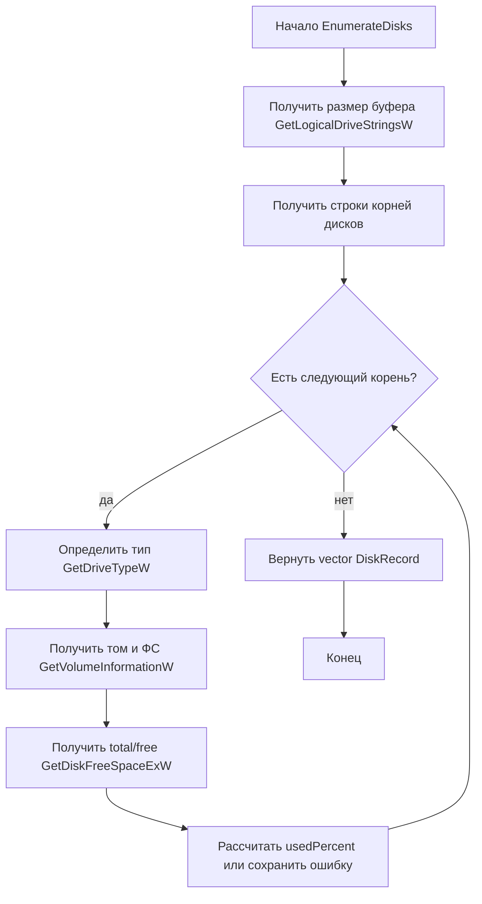

```mermaid
flowchart TD
	A[Начало EnumerateDisks] --> B[Получить размер буфера GetLogicalDriveStringsW]
	B --> C[Получить строки корней дисков]
	C --> D{Есть следующий корень?}
	D -- нет --> H[Вернуть vector DiskRecord]
	D -- да --> E[Определить тип GetDriveTypeW]
	E --> F[Получить том и ФС GetVolumeInformationW]
	F --> G[Получить total/free GetDiskFreeSpaceExW]
	G --> I[Рассчитать usedPercent или сохранить ошибку]
	I --> D
	H --> J[Конец]
```
